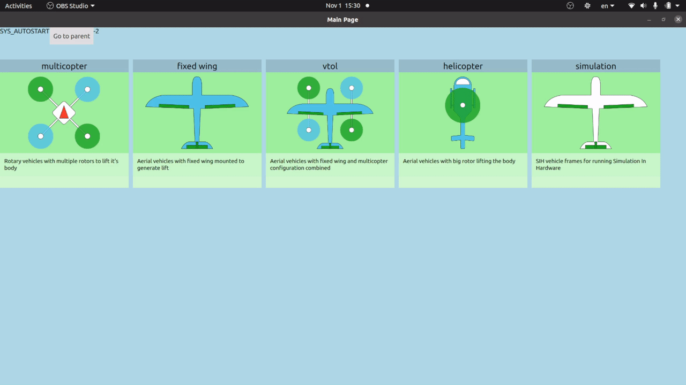

# PX4 Frame metadata support test repository



This repo includes
1. Test Qt App for visualization of the Frame selection UI for QGC
2. Test Frame Json dataset to visualize

Details about this project can also be found in this document: https://docs.google.com/document/d/1wpGDQyJLv3AHAqMH-vxWuZ1HYksX7oq_vldEXCbxmPI/edit#

## Pull Requests from this Project

- MAVLink: https://github.com/mavlink/mavlink/pull/1908
- 

## How to use

### Frame JSON Metadata

Install https://www.npmjs.com/package/ajv-cli

```bash
# To validate the Json Schema
cd Frames_UI
ajv validate -s frames.schema.json -d frames.json --verbose
```
## About Frame metadata

MAVLink supports `Component Metadata` protocol that allows the Ground Control Station to fetch the system state information from the Flight Controller. Read more about it here: https://mavlink.io/en/services/component_information.html

This Repository will be the stepping stone to creating a [new metadata type](https://mavlink.io/en/services/component_information.html#schema_files), `COMP_METADATA_TYPE_FRAMES`.

### What is a Frame?

Originally called [Airframes](https://dev.px4.io/v1.11_noredirect/en/airframes/airframe_reference.html), Frame defines the type of the vehicle (e.g. Rover, Multicopter, Fixed-wing) as well as the sub-type (e.g. Tilt-rotor VTOL / Hexacopter / etc).

Also for a specific product / vehicle configuration, it would accompany a description of the frame and it's characteristics as well.

## Structure of the Frame JSON

The JSON structure of the Frames will follow the JSON schema defined here: https://json-schema.org/specification.html. This allows having a simple JSON validation step in the python script to make sure the JSON file would be parsable from any system.

The example JSON file will be added to this directory, and then the schema will be derived from it after iterations of integrating it into the Qt UI.

Current existing example / schemas of Component Metadata JSON files can be found here: https://github.com/mavlink/mavlink/tree/master/component_metadata

### Core Idea of the Frames JSON

1. It should define the UI flow / hierarchy (Starting from higher concepts like: Multicopter / VTOL / Fixed Wing classification, down to individual vehicles) defined
2. It should treat the 'group' (collection of 'frames') and a 'frame' the same way.
   1. For example, "VTOL Tiltrotor (a 'Group')" and "Harris_VTOL (specific product: a 'Frame') should be shown next to each other
3. It should have a fixed order of items (So that UI can show consistent interpretation of the JSON file): use a 'list' instead of a 'dictionary'
4. Have multiple 'Frame' attributes that is useful for the application: To be decided
   1. User friendly name (e.g. Convergence VTOL)
   2. Description
   3. Image (even a raw Image in binary!)
   4. URL for the product (e.g. Freefly Astro)
5. Have multiple 'Group' attributes that is useful: To be decided
   1. User friendly name (e.g. tiltrotor VTOL)
   2. Description
   3. Image

## Relevant Links

1. PX4-Autopilot
   1. Actuators Metadata support PR: https://github.com/PX4/PX4-Autopilot/pull/18563
   2. Support for COMPONENT_INFORMATION: https://github.com/PX4/PX4-Autopilot/pull/16039
   3. Switch to COMPONENT_METADATA: https://github.com/mavlink/mavlink/pull/1823
2. QGC
   1. Actuators dynamic UI through Metadata support PR: https://github.com/mavlink/qgroundcontrol/pull/9952
   2. Support for COMPONENT_INFORMATION: https://github.com/PX4/PX4-Autopilot/pull/16039
   3. COMPONENT_INFORMATION .xz compression PR: https://github.com/mavlink/qgroundcontrol/pull/9242
3. MAVLink
   1. Actuators Component Information support PR: https://github.com/mavlink/mavlink/pull/1729